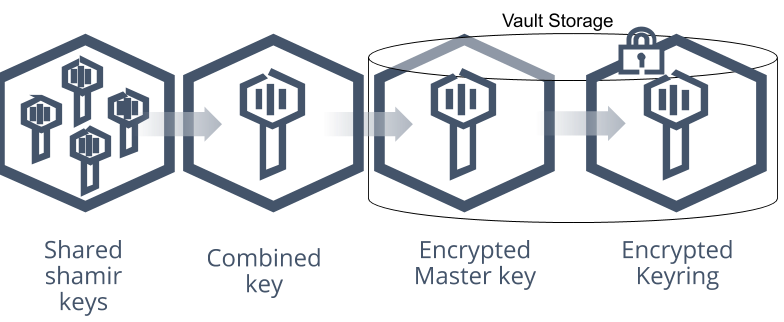

When Vault starts up, it only knows where its data is stored. It doesn't know how to decrypt the data.  This is when Vault is in a sealed state. In this state, the only operations that can be performed are initialising Vault and unsealing vault.

### Initialising Vault

When deploying a new instance of Vault, the first thing we need to do is initialise it. This is the process of generating a master key which prepares the storage backend to receive data.
As an added layer of security, Vault applies shamir's secret sharing algorithm to the master key.  This splits the master key into a configurable amount of key shares which can be securely distributed to key holders.
These key shares are known as unseal keys.



We can view the status of the Vault server by running the vault status command

```
vault status
```

As you can see from the command output, the initialized status is set to false, and the sealed status set to true.

To initialise vault, we can select how many key shares (unseal keys) that we want to create, and the minimum number of keys that must be entered to unseal the server.
By default, 5 key shares are created with a minimum threshold of 3 unseal keys to unseal the server.

To initialise Vault with the default number of unseal keys and threshold, run the following command in the terminal below:

```shell
vault operator init
```

The command output has given us two things:

- 5 unseal keys (of which a combination of any 3 of these are required to unseal vault).
- Root token.

Keep a note of the commandline output as it is needed for the next steps.

### Root token

Vault uses tokens as the authentication mechanism.  A token represents the identity of a user or application.  
The root token is a highly privileged token with unrestricted access to Vault. This token is provided to enable us to configure the Vault server. Once Vault is fully configured, we can destroy the root token and use tokens with a least-privileged approach.

### Unsealing Vault

Now Vault has been initialised, we can now unseal the server but first, lets check the status of Vault vy running 'vault status' again. As you can see from the output, the initialised status is set to true, and the sealed status is also set to true.

To unseal vault we will need any 3 of the 5 unseal keys we obtained when we initialised the server.  Unseal Vault using the 'vault operator unseal' command in the terminal box below.  You will have to eneter the command 3 times, once per unseal key like the example below:

```shell script
vault operator unseal IAyR0OJnSFobekZMMCKCoVEpT7wI6l+USMzE3IcyDyo=
vault operator unseal JByR0OJnSFobekZMMCKCoVEpT7wI6l+USMzE3IcyDyo=
vault operator unseal KCyR0OJnSFobekZMMCKCoVEpT7wI6l+USMzE3IcyDyo=
```

Once these commands have been entered, we can run the 'vault status' command again, and we should see the sealed status now set to false.

With Vault unsealed, we can now log in using the root token generated as part of the initialisation process.

```shell script
vault login
```
