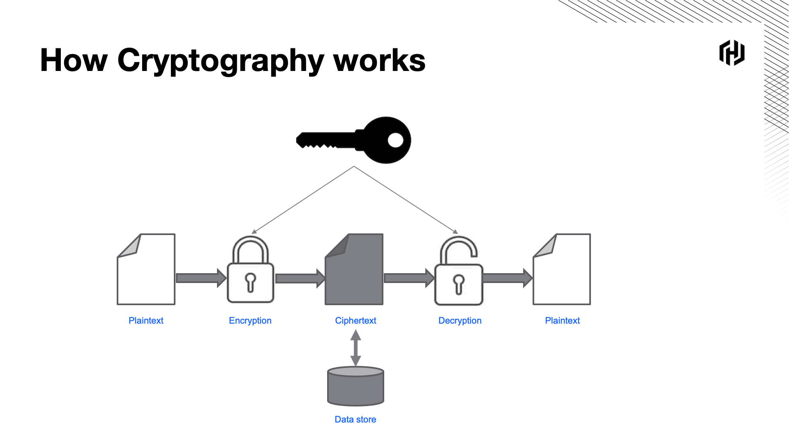

One of the features that Vault offers, is cryptography as a service.  In Cryptography, encryption is the process of scrambling plaintext data into ciphertext data using a cryptographic key and cipher to conceal the raw data. The reverse of this process is called decryption.

There are other cryptographic functions that Vault supports, including data signing and HMAC hashing.  All of these functions can be performed using the Vault API, CLI and Web UI. The component responsible for Cryptography as a Service is the Transit secrets engine. This secrets engine, will manage the full lifecycle of cryptographic keys as well as allow us to perform cryptographic functions against these keys.
